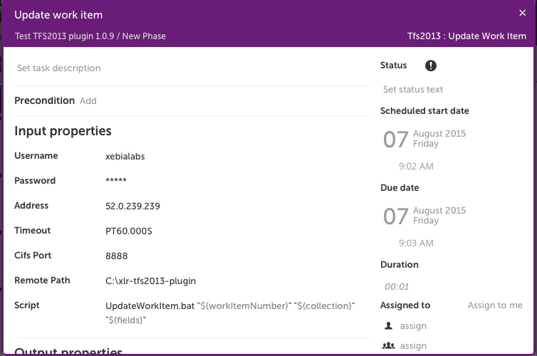
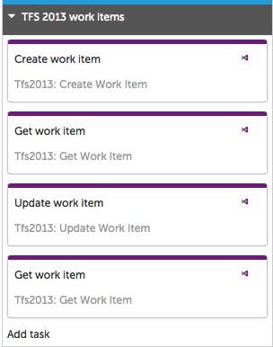
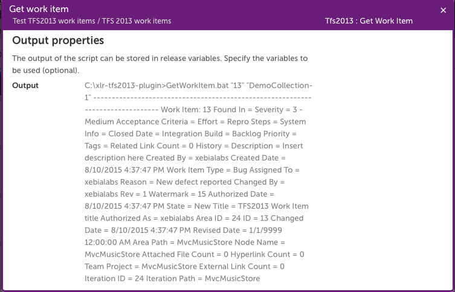
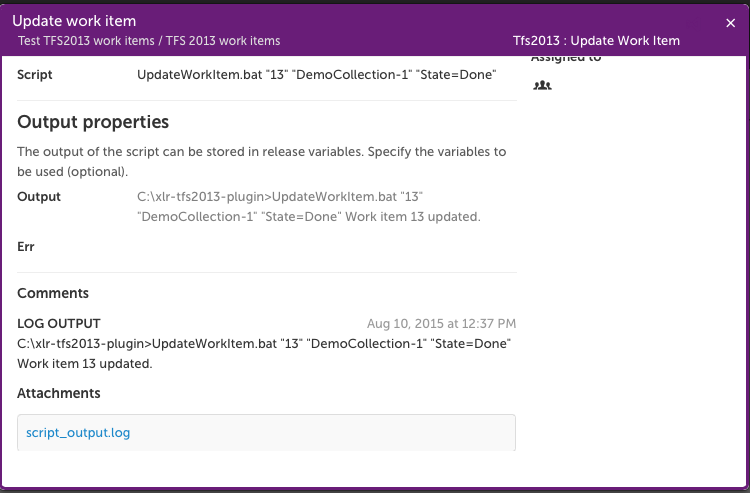

# xlr-tfs-plugin

This plugin offers an interface from XL Release to Team Foundation Server to create, update and retrieve Work Items. 

Various APIs are supported:  Team Foundation Power Tools, TFS REST API, and the TFS SDK.

## CI status ##

[![Build Status][xlr-tfs-plugin-travis-image]][xlr-tfs-plugin-travis-url]
[![Codacy Badge][xlr-tfs-plugin-codacy-image] ][xlr-tfs-plugin-codacy-url]
[![Code Climate][xlr-tfs-plugin-code-climate-image] ][xlr-tfs-plugin-code-climate-url]

[xlr-tfs-plugin-travis-image]: https://travis-ci.org/xebialabs-community/xlr-tfs-plugin.svg?branch=master
[xlr-tfs-plugin-travis-url]: https://travis-ci.org/xebialabs-community/xlr-tfs-plugin
[xlr-tfs-plugin-codacy-image]: https://api.codacy.com/project/badge/Grade/b11c699b6164409a93e9cfc8ee318016
[xlr-tfs-plugin-codacy-url]: https://www.codacy.com/app/joris-dewinne/xlr-tfs-plugin
[xlr-tfs-plugin-code-climate-image]: https://codeclimate.com/github/xebialabs-community/xlr-tfs-plugin/badges/gpa.svg
[xlr-tfs-plugin-code-climate-url]: https://codeclimate.com/github/xebialabs-community/xlr-tfs-plugin

## Installation ##
+ The plugin https://github.com/xebialabs-community/xlr-tfs-plugin/releases should be placed under `plugins`.
+ Custom Http client: https://github.com/droberts2013/xl-release/blob/afc1468c9fde54d03f046211fbc1b9e1068106c1/server/src/main/resources/pythonutil/HttpRequest.py
  This should go under `ext/pythonutil`
+ Additional lib: https://www.microsoft.com/en-us/download/confirmation.aspx?id=22616
  This contains a file called: com.microsoft.tfs.sdk-11.0.0.jar which should be placed under `plugins`.

## Team Foundation Power Tools
The following actions are supported:

### CreateWorkItem
The CreateWorkItem.py script creates a new Work Item by executing a remote Windows batch wrapper script, CreateWorkItems.bat.  Input parameters are Project, Type, Collection, Title, AssignedTo, and Description; the script returns the number of the Work Item created.  

### GetWorkItem
The GetWorkItem.py script retrieves a Work Item given its number and collection using the GetWorkItem.bat wrapper script.  Input parameters are workItemNumber and collection.

### UpdateWorkItem
The UpdateWorkItem.py script updates a Work Item given its number, collection, and set of update fields and values in the format `fieldname1=value1;fieldname2=value2`.  See an example of setting `State=Done` at the end of this document.

### Notes:  
The TFS machine must have Microsoft Visual Studio Team Foundation Server 2013 Update 2 Power Tools installed.  

The CreateWorkItem.bat, GetWorkItem.bat, and UpdateWorkItem.bat scripts must be placed in a location on the TFS machine.  The default location is C:\xlr-tfs2013-plugin.

A field is provided for the Windows CIFS port (default is 445) to allow overriding a blocked port.

The functionality will be enhanced as specific needs materialize.

## TFS REST API

This plugin offers an interface from XL Release to Team Foundation Server via the REST API valid for work items in TFS 2015.  It provides:

**CreateWorkItem.py** -- creates a Work Item given Collection, Project, Type and Title parameters

**AddWorkItemComment.py** -- adds a Work Item comment given Collection, Work Item Id and Comment parameters

**GetTfsRepoArtifacts.py** -- retrieves an item from a TFS Git repository given the collection and scopepath (assumes a single repository and a single match)

The functionality will be enriched with additional Work Item fields as specific needs materialize.

Note:  HttpRequest.py in older versions of XL Release must be enhanced to support the HTTP PATCH method.  See [droberts2013/xl-release/server/src/main/resources/pythonutil/HttpRequest.py](https://github.com/droberts2013/xl-release/blob/afc1468c9fde54d03f046211fbc1b9e1068106c1/server/src/main/resources/pythonutil/HttpRequest.py) if necessary.  Place this custom file in <xl-release-server>/ext/pythonutil.

## TFS SDK

The TFS SDK depends on the following configuration changes in XL Release:

Script.policy file — confirm these lines:

permission  java.util.PropertyPermission "\*", "read, write";
permission java.lang.RuntimePermission "shutdownHooks";
permission java.io.FilePermission "conf/\*", "read";
permission java.io.FilePermission "lib/\*", "read";
permission java.io.FilePermission "plugins/\*", "read";
permission java.security.AllPermission;

Add the library com.microsoft.tfs.sdk-11.0.0.jar to /lib.

Unzip native.zip in the <xl-release-server>/conf directory. 

### Example configuration, TFPT

Here is a basic workflow of four items to create a Work Item, then retrieve it, update it, and retrieve it again to see the modification.

The variables appearing in the above screenshots are set in this manner:

Note that workItemNumber is set as an output variable by the createWorkItem task.

Successful execution of the release results in the following output:

**Create Work Item**

**Get Work Item, note State=New**

**Update Work Item**

**Get Work Item, note State=Done**

